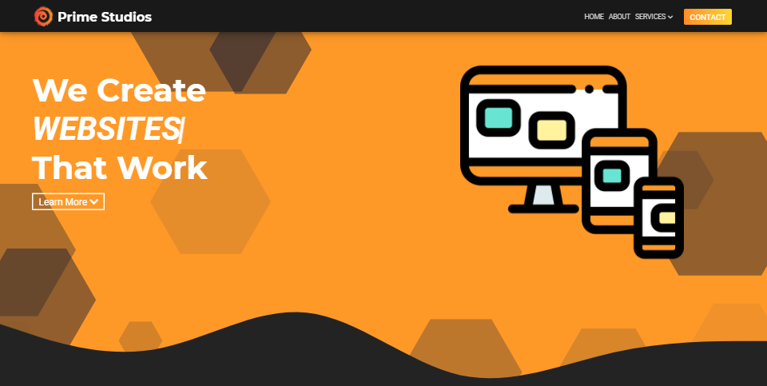

# Prime Studios Website

 

## Overview

This repository contains the project files for Prime Studios' Website.

## Team

**[BillyIsMe](https://github.com/TheBillyIsMe)** - Full Stack Developer

**[Michael Rizzuto](https://github.com/MichaelRizzuto)** - Full Stack Developer

## License

This project is licensed under the [MIT License](./LICENSE.md) &copy; 2019-2020 [Prime Studios](https://github.com/PrimeStudios/).
